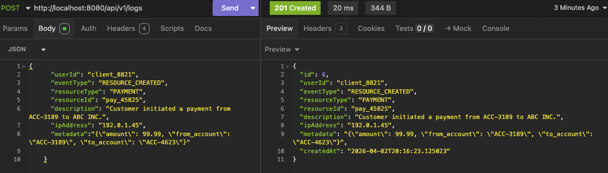

Activity Log API is a lightweight REST API built with Java Spring Boot and an H2 in-memory database for recording and querying user activity events within a system. 
It exposes endpoints to log actions such as logins, logouts, and resource lifecycle events (create, update, delete), with support for flexible filtering by user, event type, and date range — all returned with pagination. 
The project is designed as a clean, self-contained backend service with structured error handling and request validation, making it easy to integrate into any existing application as an audit trail or activity monitoring layer.

## Tech Stack
- **Java 21** - core language
- **SpringBoot 3.5** - web framwerok, JPA, Validation
- **H2** - in memory relational database (auto-configured)
- **Lombok** - boilerplate reduction
- **Spring Data JPA** - repository and query layer
- **Maven** 3.8+

## Supported Event Types
- USER_LOGIN
- USER_LOGOUT
- RESOURCE_CREATED
- RESOURCE_UPDATED
- RESOURCE_DELETED

## API endpoints
Base URL: http://localhost:8080/api/v1/logs

- Record an activity event POST(http://localhost:8080/api/v1/logs)

- Filter logs by user ID   GET (http://localhost:8080/api/v1/logs)

- Filter logs by user ID & event type  GET(http://localhost:8080/api/v1/logs?userId=client_8821&eventType=USER_LOGIN)

- Retrieve a single log  GET(http://localhost:8080/api/v1/logs/2)

- Validation failure test GET(http://localhost:8080/api/v1/logs)
